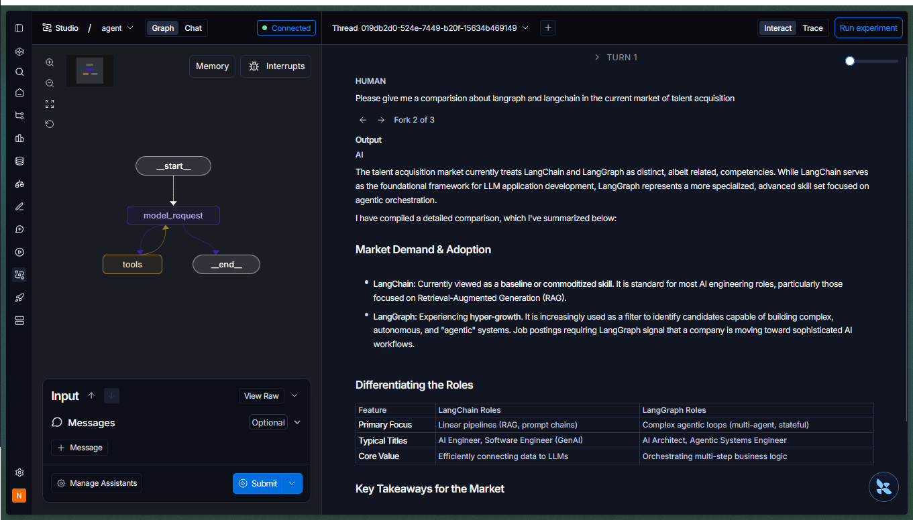

# Deep Agent

A sophisticated research assistant capable of breaking down complex queries, delegating tasks to specialized sub-agents, and managing a virtual file system to compile comprehensive findings.

> **Note:** This project is a TypeScript adaptation of the final project from the Langchain Academy course "Deep Agents" in Python. The original implementation can be found here: `https://github.com/langchain-ai/deep-agents-from-scratch/blob/main/notebooks/4_full_agent.ipynb` .

This project uses LangGraph and LLMs (specifically Gemini) to manage complex research workflows across three main areas:

1. **Task Delegation**: A main agent that coordinates research by delegating specific tasks to specialized sub-agents (e.g., `research-agent`).
2. **Virtual File System**: A state-managed file system where the agent can read, write, and list files to store research findings and context.
3. **To-Do Management**: A built-in task tracking system that allows the agent to plan, execute, and monitor its progress through complex workflows.

## Architecture

The agent is built with LangGraph and features a state graph with the following core components:
- `DeepAgent`: The main orchestrator that interacts with the user, manages the To-Do list, and decides when to delegate tasks.
- `research-agent`: A specialized sub-agent equipped with web search (`tavily_search`) and strategic reflection (`think`) tools to gather and analyze information.
- **State Management**: Maintains `messages`, a virtual `files` system, and a `todos` list across the conversation.
- **Tools**: Includes built-in tools for file operations (`ls`, `readFile`, `writeFile`), To-Do management (`readTodos`, `writeTodos`), and task delegation (`sub_agent_task`).

## LangSmith Studio

The agent can be explored interactively in `https://smith.langchain.com/` using the dev server (`bun run dev`). The graph topology is rendered live, and each node execution is traced in the right-hand panel — making it easy to inspect tool calls, file system updates, and sub-agent delegations in real time.



## Planned Features

- **Enhanced Sub-Agents**: Addition of more specialized sub-agents (e.g., for coding, data analysis, or writing) to expand the agent's capabilities beyond general research.
- **Persistent Storage**: Integration with a database or local file system to persist the virtual file system and To-Do lists across sessions.

## Getting Started

Implement the environments from the .env.example in another .env or .env.local

To install dependencies:

```bash
bun install
```

To run:

```bash
bun run config

bun run dev
```

This project was created using `bun init` in bun v1.2.18. `https://bun.com` is a fast all-in-one JavaScript runtime.
